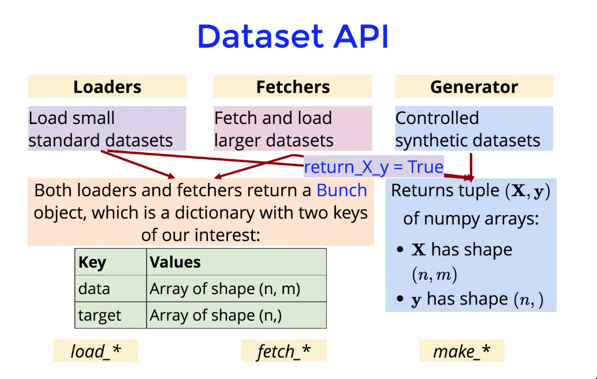
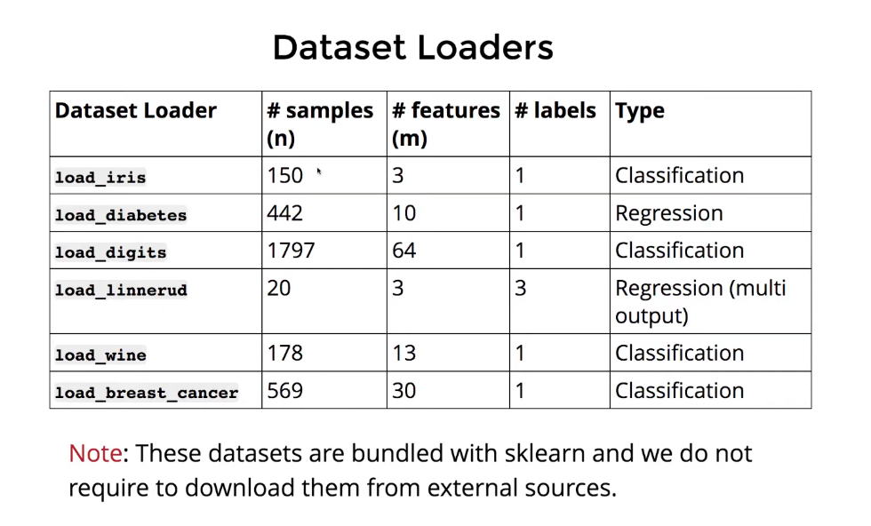
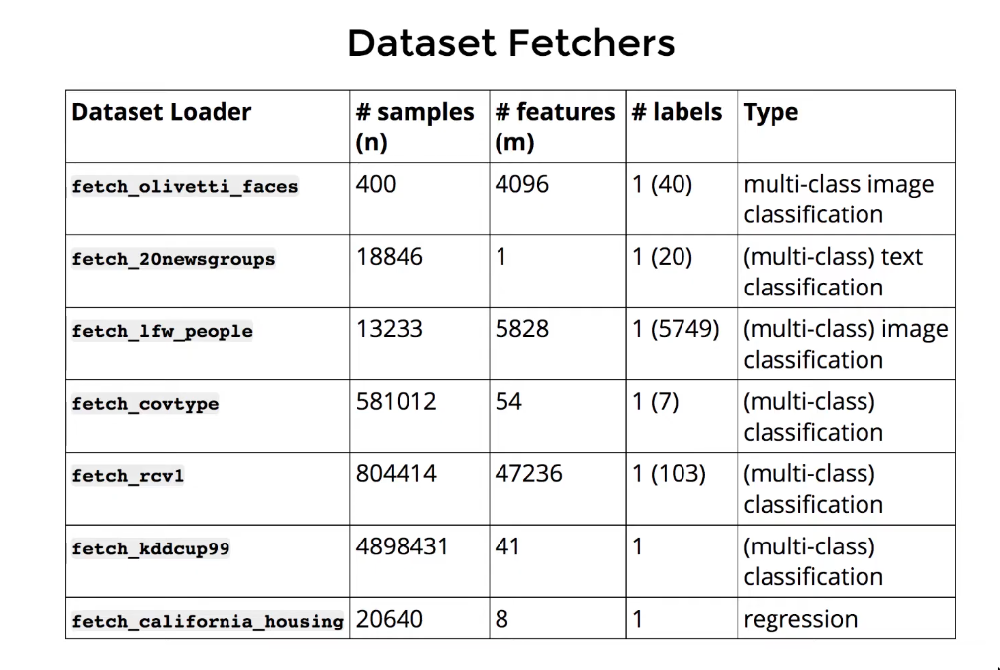

# Data Loading
General dataset API has three main kind of interfaces:
* The dataset **loaders** are used to **load** toy datasets bundled with sklearn.
* The dataset **fetchers** are used to **download and load** datasets from the internet.
* The dataset **generators** are used to **generate** controlled synthetic datasets.

### Dataset loaders

### Dataset fetchers

* these datasets are not bundled with sklearn.
* we can download them from the web
* sklearn fetchers does this for us

### Dataset generators:
##### Regression:
* `make_regression()` produces regression targets as a sparse random linear combination of random features with noise.
* the informative features are either uncorrelated or low rank

##### Classification:
* **Single label**: `make_blobs()` and `make_classification()` first creates a bunch of normally-distributed clusters of points and then assign one or more clusters to each class thereby creating multi-class datasets.
* **Multilabel**: `make_multilabel_classification()` generates random samples with multiple labels with a specific generative process and rejection sampling 

##### Clustering:
* `make_blobs()` generates bunch of normally-distributed clusters of points with specific mean and standard deviation for each cluster.

### Loading external datasets:
- ***fetch_openml()*** fetches datasets from [openml.org](http://openml.org/), which is a public repository for machine learning data and experiments.
- [***pandas.io***](http://pandas.io) provides tools to read from common formats like CSV, excel, json, SQL.
- [***scipy.io](http://scipy.io)*** specializes in binary formats used in scientific computing like .mat and .arff.
- ***numpy/ routines.io*** specializes in loading columnar data into NumPy arrays.
- ***dataset.load_files*** loads directories of text files where directory name is a label and each file is a sample.
- ***datasets.load_svmlight_files()*** loads data in svmlight and libSVM sparse format.
- [***skimage.io***](http://skimage.io/) provides tools to load images and videos in numpy arrays.
- ***scipy.io.wavfile.read*** specializes reading WAV file into a numpy array.

> For managing numerical data, sklearn recommends using an optimized file format such as **HDF5**(Hierarchical Data Formation version 5) to reduce data load times.
> Pandas, PY Tables and H5PY provides an interface to read and write in that format
